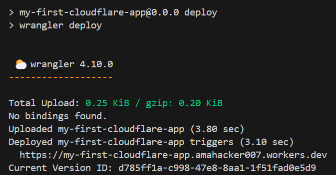

# 1. **What are backends servers?**


- You might’ve used express to create a Backend server.
- The way to run it usually is node index.js which starts a process on a certain port (3000 for example)
- When you have to deploy it on the internet, there are a few ways - 
i. Go to aws, GCP, Azure, Cloudflare
    - Rent a VM (Virtual Machine) and deploy your app
    - Put it in an Auto scaling group
    - Deploy it in a Kubernetes cluster
 
There are a few downsides to doing this - 
    i Taking care of how/when to scale 
    ii. Base cost even if no one is visiting your website
    ii. Monitoring various servers to make sure no server is down

- What if, you could just write the code and someone else could take care of all of these problems?

# 2. **What are serverless Backends**

"Serverless" is a backend deployment in which the cloud provider dynamically manages the allocation and provisioning of servers. The term "serverless" doesn't mean there are no servers involved. Instead, it means that developers and operators do not have to worry about the servers.
 
## Easier defination
What if you could just write your express routes and run a command. The app would automatically 
1. Deploy
2. Autoscale
3. Charge you on a per request basis (rather than you paying for VMs)
 
Problems with this approach
1. More expensive at scale
2. Cold start problem

# 3. **Famous serverless providers**

- There are many famous backend serverless providers-
1. AWS Lambda
2. Google Cloud Functions
3. Cloudflare Workers

# 4. **When should you use a serverless architecture?**

1. When you have to get off the ground fast and don't want to worry about deployments.
2. When you can't anticipate the traffic and don't want to worry about autoscaling.
3. If you have very low traffic and want to optimise for costs.

# 5. **How cloudflare workers work?**

- [How cloudflare workers work](https://developers.cloudflare.com/workers/reference/how-workers-works/)

# 6. **Initializing a worker**

Worker is just a name given by them of this service.
To create and deploy your application, you can take the following steps-
- Initialize a worker.

```
npm create cloudflare@latest -- my-first-worker
```

After deployment you might see something like below:


- Explore package.json dependencies.
    **Wrangler** is the CLI of cloudflare.

- Start the worker locally.
    ```
    npm run dev
    ```
- How to return json?


### Question - Where is the express code? HTTP Server?

Cloudflare expects you to just write the logic to handle a request.
Creating an HTTP server on top is handled by cloudflare.

### Question - How can I do routing?
In express, routing is done as follows-


How can you do the same in Cloudflare environment?


## Deploying the website
- Run ```npx wrangler login``` to login first.
- Run ```npx wrangler whoami``` to verify your login (if you want to).
- Run ```npm run deploy``` to deploy.
- Result should be something like this on the console.



### Assigning a custom domain

- You have to buy a plan to be able to do this.
- You also need to buy the domain on cloudflare/transfer the domain to cloudflare.

>We can't use socket.io on serverless functions. They are purely based for **HTTP** requests.


# What is Hono?

- Visit [Hono Node.js page](https://hono.dev/docs/getting-started/nodejs) for setup.
- Visit [Hono motivation](https://hono.dev/docs/concepts/motivation) to get clarification.

## What runtime does it support?


## Workers with cloudflare workers - 

1. Initialize a new app
```
npm create hono@latest my-hono-app
```
Chose 'cloudflare workers' while installing hono packages.
The result should be somewhat like this - 


2. Move to my-hono-app and install dependencies.
```
cd my-hono-app
npm i
```

3. Hello World


4. Getting inputs from user


### Why do we await whenever we fetch a json?

- c.req.json() is asynchronous because:
    - Reading the request body is I/O-bound
    - Parsing happens after all data is received
- So you await to get the real JSON object

⚡ Without await, you're just holding a wrapped gift and never opening it.


## Deploy

```
npm run dev
```


## Middlewares

[Hono Middleware](https://hono.dev/docs/guides/middleware)

### Creating a simple auth middleware


```
In short, if we compare cloudflare env to nodejs env

Hono (Cloudflare) ≈ Express.js (Node.js)
Wrangler (Cloudflare) ≈ Combination of:
- npm/yarn (package manager)
- nodemon (auto-reload during development)
- Deploy tools (e.g., AWS CLI, Heroku CLI, or Docker CLI)
```