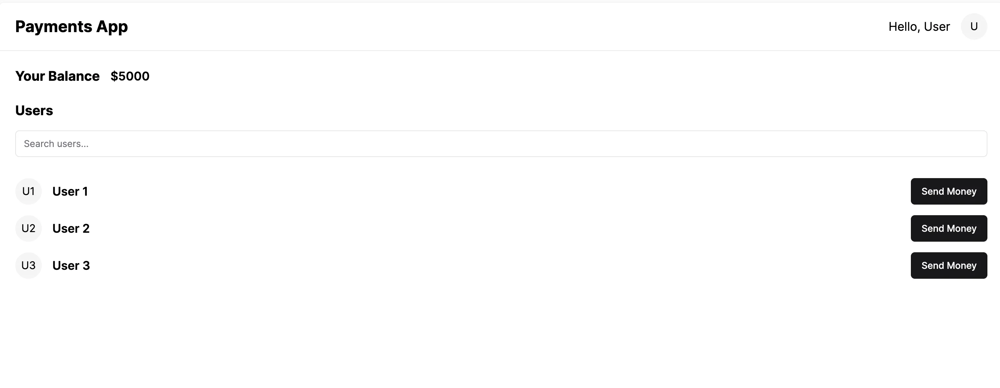

# Paytm
    - The goal is to build paytm clone (using whatever we have learnt till now).
    - We’re building a PayTM like application that let’s users send money to each other given an initial dummy balance.
    - First clone - 'https://github.com/100xdevs-cohort-2/paytm'.
    - This is a boiler plate code(this didn't work properly as it had dependency issue).

# Ids and passwords:
1. benakshit007@gmail.com : Akshit#123
2. Rohit.mehra@gmail.com : Rohit123
3. jagmohan.reddy : Jagmohan123
4. Sana.khan : Sana123
5. Akash_ : Akash123
6. Rakesh.kumar : Rakesh123