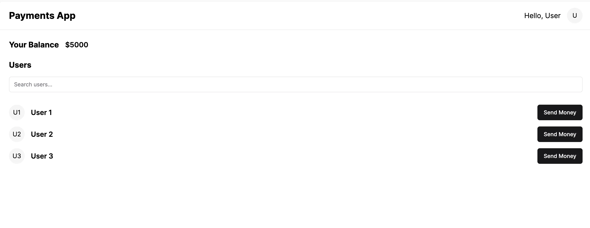

# Step 1 - What are we building, Clone the starter repo
 

 
**Things to do**
- Clone the 8.2 repository from https://github.com/100xdevs-cohort-2/paytm
- git clone https://github.com/100xdevs-cohort-2/paytm

💡 Please keep a MongoDB url handy before you proceed. This will be your primary database for this assignment.
- Create a free one here - https://www.mongodb.com/
 
Explore the repository
The repo is a basic express + react + tailwind boilerplate

**Backend**
Express - HTTP Server
mongoose - ODM to connect to MongoDB
zod - Input validation

**Frontend**
React - Frontend framework
Tailwind - Styling framework

----------------------------------------------------------------------------------------------------------------------------

# Step 2 - User Mongoose schemas
 
We need to support 3 routes for user authentication:
1. Allow user to sign up.
2. Allow user to sign in.
3. Allow user to update their information (firstName, lastName, password).
 
To start off, create the mongo schema for the users table:
1. Create a new file (db.js) in the root folder
2. Import mongoose and connect to a database of your choice
3. Create the mongoose schema for the users table 
4. Export the mongoose model from the file (call it User)

-----------------------------------------------------------------------------------------------------------------------------

# Step 3 - Create routing file structure

In the index.js file, route all the requests to /api/v1 to a apiRouter defined in backend/routes/index.js

1. Create a new file backend/routes/index.js that exports a new express router.
(How to create a router - https://www.geeksforgeeks.org/express-js-express-router-function/)

2. Import the router in index.js and route all requests from /api/v1 to it.

------------------------------------------------------------------------------------------------------------------------------

# Step 4 - Route user requests

1. Create a new user router
Define a new router in backend/routes/user.js and import it in the index router.
Route all requests that go to /api/v1/user to the user router.

2. Create a new user router
Import the userRouter in backend/routes/index.js so all requesrs to /api/v1/user get routed to the userRouter.

------------------------------------------------------------------------------------------------------------------------------

# Step 5 - Add cors, body parser and jsonwebtoken

1. Add cors
Since out frontend and backend will be hosted on separate routes, add the cors middleware to backend/index.js.

2. Add body-parser
Since we have to support the JSON body in requests, add the express body parser middleware to backend/index.js.
You can use the body-parser npm library, or use express.json.

3. Add jsonwebtoken
We will be adding authentication soon to our application, so install jsonwebtoken library. 

4. EXPORT JWT_SECRET
Export a JWT_SECRET from a new file backend/config.js
(i am storing in .env file)

5. Listen on port 3000
Make the express app listen on PORT 3000 of your machine.

------------------------------------------------------------------------------------------------------------------------------

# Step - 6 Add backend auth routes

In the user router (backend/routes/user), add 3 new routes.

1. Signup
This routes needs to get user information, do input validation using zod and store the information in the database provided
    1. Inputs are correct (validated via zod)
    2. Database doesn't already contain another user

If all goes well, we need to return the user a jwt which has their user id encoded as follows-
{
    userId: "userId of newly added user"
}

💡 Note - We are not hashing passwords before putting them in the database. This is standard practice that should be done, you can find more detaisl here - https://mojoauth.com/blog/hashing-passwords-in-nodejs/
- I am using 'Argon2' (can also use Bcrypt) hashing technique to hash passwords.

Method: POST
Route: /api/v1/user/signup
Body:
    {
        username: "name@gmail.com",
        firstName: "name",
        lastName: "name",
        password: "123456"
    }
Response:
Status code - 200
{
    message: "User created successfully",
    token: "jwt"
}
Status code - 411
{
    message: "Email already taken/ Incorrect inputs"
}

2. Route to sign in
Let's an existing user sign in to get back a token.

Method: POST
Route: /api/v1/user/signin
Body:
    {
        username: "name@gmail.com",
        password: "123456"
    }
Response:
Status code - 200
{
    token: "jwt"
}
Status code - 411
{
    message: "Error while loggin in"
}

------------------------------------------------------------------------------------------------------------------------------

# Step 7 - Middleware
Now that we have a user account, we need to gate routes which authenticated users can hit.
For this, we need to introduce an auth middleware

Create a middleware.js file that exports an authMiddleware function
1. Check the headers fpr an Authorization header (Bearer <token>)
2. Verifies that the token is valid.
3. Puts the userId in the request object if the token checks out.
4. If not, return a 403 status back to the user

Header -
Authorization: Bearer <actual token>

------------------------------------------------------------------------------------------------------------------------------

# Step 8 - User routes

1. Route to update user information
User should be allowed to optionally send either or all of
    1. password
    2. firstName
    3. lastName

Whatever they send, we need to udpate it in the database for the user.
Use the middleware we defined in the last section to authenticate the user

Method: PUT
Route: /api/v1/user
Body:
{
    password: "new_password,
    firstName: "updated_first_name",
    lastName: "updated_first_name",
}
Response:
Status code - 200
{
    message: "Updated successfully"
}
Status code - 411(Password is too small...)
{
    message: "Error while updating information"
}

2. Route to get users from the backend, filterable via firstName/lastName
This is needed so users can search for their friends and send them money

Method: GET
Route: /api/v1/user/bulk
Query Parameter: ?filter=akshit

Response:
Status code - 200
{
    users:[{
        firstName: "",
        lastName: "",
        _id: "id of the user"
    }]
}

------------------------------------------------------------------------------------------------------------------------------

# Step 9 - Create bank  related Schema

Update the db.js file to add one new schema and exoprt the respective models

Account table
The Accounts table will store the INR balances of a user.
The schema should look something like this -
{
    userId: ObjectId(or string),
    balance: float/number
}

In the real world, you shouln't store 'floats' for balances in the databases.
You usually store an integer which represent the INR value with decimal places (for eg, if someone has 33.33 rs in their account, you store 3333 in the database).

There is a certain precision that you need to support (which for India is 2/4 decimal places) and this allows you to get rid of precision errors by storing integers in your DB.

You should reference the users table in the schema (hint - https://medium.com/@mendes.develop/joining-tables-in-mongodb-with-mongoose-489d72c84b60)

------------------------------------------------------------------------------------------------------------------------------

# Step 10 - Transactions in databases

A lot of times, you want multiple databases transactions to be atomic.
Either all of them should update, or none should.

This is super important in the case of a bank.

--> The code of this step was provided with some corrections to be done at our end.
--> There was no implementation done in the codebase, this starts at step 13.
--> To maintain atomicity property, we should use 'transactions' a topic in DBMS.

# Step 11 - Initialise balances on signup
Update the signup endpoint to give the user a random balance between 1 and 100000.
This is so we don't have to integrate with banks and give them random balances to start with.

------------------------------------------------------------------------------------------------------------------------------

# Step 12 - Create a new router for accounts

1. Create a new router
All user balances should go to a different express router (that handles all requests on /api/v1/account).
Create a new router in routes/account.js and add export it.

2. Route requests to it
Send all requests from /api/v1/account/* in routes/index.js to the router created in step1.

# Step 13 - Balance and transfer Endpoints

Here, you will be writing a bunch of APIs for the core user balance. There are 2 endpoints that we need to implement

1. An endpoint for user to get their balance.

Method: GET
Route: /api/v1/account/balance
Response: Status code - 200
{
    balance: 100
}

2. An endpoint for user to transfer money to another account
Method: POST
Route: /api/v1/account/transfer
Body:
{
    to: string,
    amount: number
}
Response:
Status code - 200
{
    message: "Transfer successful"
}
Status code - 400
{
    message: "Insufficient balance"
}
Status code - 400
{
    message: "Invalid account"
}

- Problems you might run into the problem mentioned above, ⬇️
https://stackoverflow.com/questions/51461952/mongodb-v4-0-transaction-mongoerror-transaction-numbers-are-only-allowed-on-a

- Read more about sessions - https://www.mongodb.com/docs/manual/reference/method/Session/

------------------------------------------------------------------------------------------------------------------------------

# Step 14 - Checkpoint you solution
A completely working backend can be found here - https://github.com/100xdevs-cohort-2/paytm/tree/backend-solution.
Try to send a few calls via postman to ensure you are able to signup/signin/get balance.

--> Basically test the backend