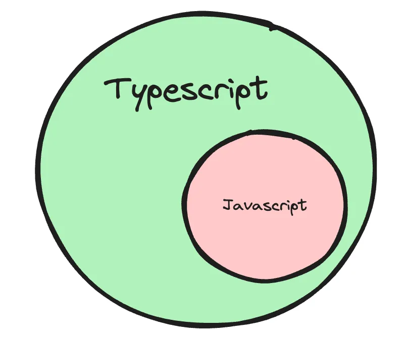
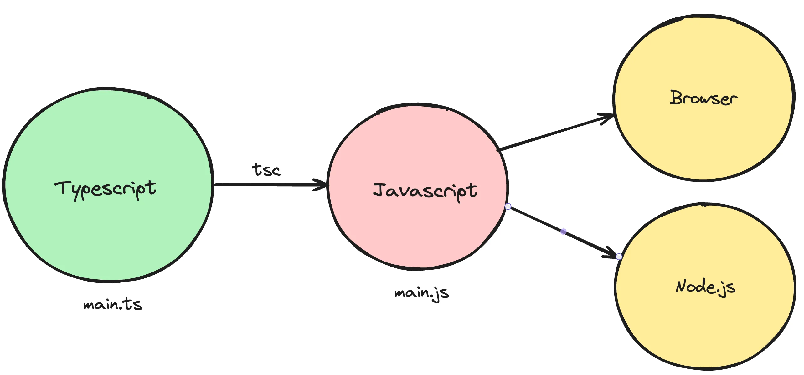
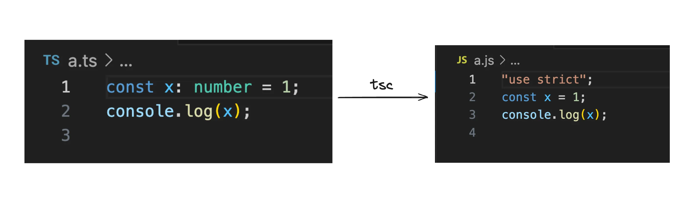
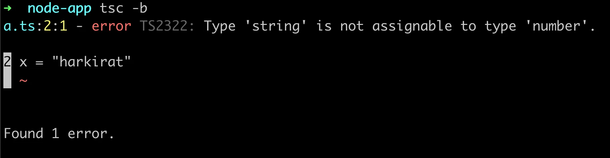
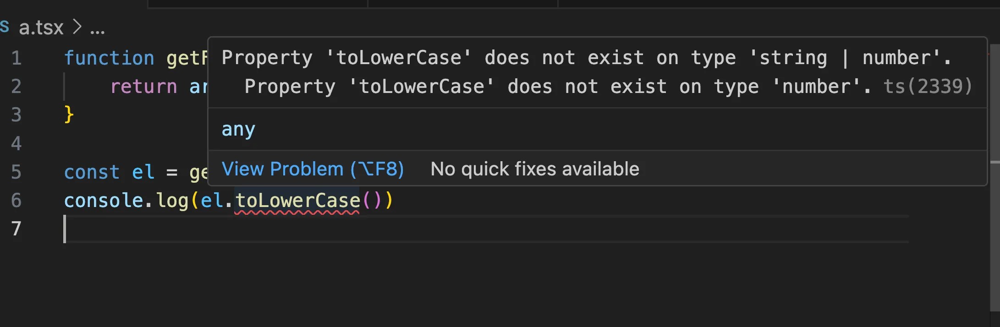
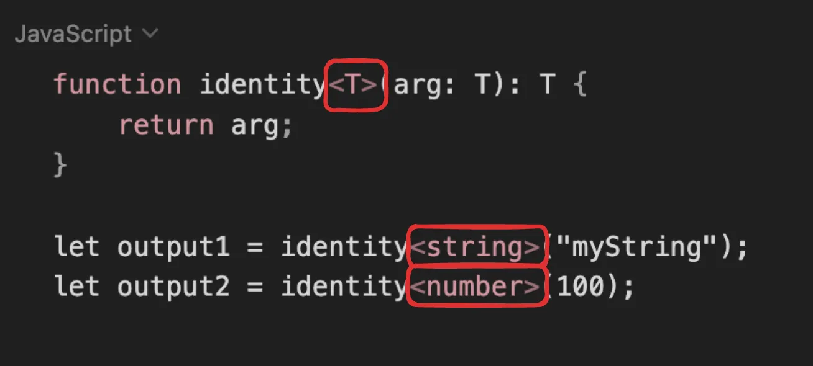

# Step 1 - Types of languages

1. Strongly typed vs loosely typed
-> The terms strongly typed and loosely typed refer to how programming languages handle types, particularly how strict they are about type conversions and type safety.

**Strongly typed languages**
i. Examples - Java, C++, C, Rust
ii. Benefits - 
    - Lesser runtime errors
    - Stricter codebase
    - Easy to catch errors at compile time
 
iii. Code doesn’t work ❌
    #include <iostream>
    int main() {
        int number = 10;
        number = "text";
        return 0;
    }

2. Loosely typed languages
i. Examples - Python, Javascript, Perl, php
ii. Benefits
    - Easy to write code
    - Fast to bootstrap
    - Low learning curve
 
iii. Code does work ✅

    function main() {
        let number = 10;
        number = "text";
        return number;
    }

 
-> People realised that javascript is a very power language, but lacks types.
-> Typescript was introduced as a new language to add types on top of javascript.

# Step 2 - What is Typescript
- TypeScript is a programming language developed and maintained by Microsoft. 
- It is a strict syntactical superset of JavaScript and adds optional static typing to the language.

1. Where/How does typescript code run?
- Typescript code never runs in your browser. Your browser can only understand javascript. 
- Javascript is the runtime language (the thing that actually runs in your browser/nodejs runtime)
- Typescript is something that compiles down to javascript
- When typescript is compiled down to javascript, you get type checking (similar to C++). If there is an error, the conversion to Javascript fails. 

 
2. Typescript compiler
- tsc is the official typescript compiler that you can use to convert Typescript code into Javascript
- There are many other famous compilers/transpilers for converting Typescript to Javascript. 
- Some famous ones are - 
    - esbuild
    - swc

# Step 3 - The tsc compiler
- Let’s bootstrap a simple Typescript Node.js application locally on our machines
 
**Step 1** - Install tsc/typescript globally
    npm install -g typescript

**Step 2** - Initialize an empty Node.js project with typescript
    mkdir node-app
    cd node-app
    npm init -y
    npx tsc --init

- These commands should initialize two files in your project

 
**Step 3** - Create a a.ts file
    const x: number = 1;
    console.log(x);

**Step 4**- Compile the ts file to js file
tsc -b

**Step 5** - Explore the newly generated index.js file

 
Notice how there is no typescript code in the javascript file. It’s a plain old js file with no types
 
**Step 7** - Delete a.js
**Step 8** - Try assigning x to a string
- Make sure you convert the const to let
    let x: number = 1;
    x = "harkirat"
    console.log(x);

**Step 9** - Try compiling the code again
    tsc -b
- Notice all the errors you see in the console. This tells you there are type errors in your codebase.
- Also notice that no index.js is created anymore

- This is the high level benefit of typescript. It lets you catch type errors at compile time

# Step 4 - Basic Types in TypeScript
1. Typescript provides you some basic types
    - number, string, boolean, null, undefined.
    - Let’s create some simple applications using these types:

2. Thing to learn - How to give types to arguments of a function
    - Problem 1 - Write a function that greets a user given their first name. 
        Argument - firstName
        Logs - Hello {firstName}
        Doesn’t return anything

3. Thing to learn - How to assign a return type to a function
    - Problem 2 - Write a function that calculates the sum of two functions
    - Problem 3 - Return true or false based on if a user is 18+

4. Thing to learn - Type inference
    - Problem 4 - Create a function that takes another function as input, and runs it after 1 second.

# Step 5 - The tsconfig file
- The tsconfig file has a bunch of options that you can change to change the compilation process.
- Some of these include
 
1. target
- The target option in a tsconfig.json file specifies the ECMAScript target version to which the TypeScript compiler will compile the TypeScript code.
- To try it out, try compiling the following code for target being ES5 and es2020
    const greet = (name: string) => `Hello, ${name}!`;

2. rootDir (search in the config file and update)
- Where should the compiler look for .ts files. 
- Good practise is for this to be the src folder

3. outDir (search in the config file and update)
- Where should the compiler look for spit out the .js files.

**note** - now we can introduce '.gitignore' file.

4. noImplicitAny (search in the config file and update)
- Try enabling it and see the compilation errors on the following code - 
    const greet = (name) => `Hello, ${name}!`;
- Then try disabling it
- basically it will not show compiler error for not implicitly giving 'data type'

5. removeComments
- Weather or not to include comments in the final js file.

# Step 6 - Interfaces

1. What are interfaces

How can you assign types to objects? For example, a user object that looks like this - 
const user = {
	firstName: "Akshit",
	lastName: "Yadav",
	email: "email@gmail.com".
	age: 21,
}

To assign a type to the user object, you can use interfaces
interface User {
	firstName: string;
	lastName: string;
	email: string;
	age: number;
}

 
Assignment #1 - Create a function isLegal that returns true or false if a user is above 18. 
              - It takes a user as an input.
 
Assignment #2 - Create a React component that takes todos as an input and renders them.
              - Select typescript when initialising the react project using npm create vite@latest

2. Implementing interfaces

- Interfaces have another special property.
- You can implement interfaces as a class.
Let’s say you have an personinterface - 
    interface Person {
        name: string;
        age: number;
        greet(phrase: string): void;
    }

- You can create a class which implements this interface.
    class Employee implements Person {
        name: string;
        age: number;

        constructor(n: string, a: number) {
            this.name = n;
            this.age = a;
        }

        greet(phrase: string) {
            console.log(`${phrase} ${this.name}`);
        }
    }

- This is useful since now you can create multiple variants of a person (Manager, CEO …)
 
**Summary**: 
- You can use interfaces to aggregate data
- You can use interfaces to implement classes from

# Step 7 - Types

- What are types?
- Very similar to interfaces , types let you aggregate data together.
    type User = {
        firstName: string;
        lastName: string;
        age: number
    }

But they let you do a few other things.
 
1. Unions
- Let’s say you want to print the id of a user, which can be a number or a string.
💡
- You can not do this using interfaces:

    type StringOrNumber = string | number;
    function printId(id: StringOrNumber) {
        console.log(`ID: ${id}`);
    }

    printId(101); // ID: 101
    printId("202"); // ID: 202

2. Intersection
- What if you want to create a type that has every property of multiple types/ interfaces
💡
- You can not do this using interfaces
    type Employee = {
        name: string;
        startDate: Date;
    };

    type Manager = {
        name: string;
        department: string;
    };

    type TeamLead = Employee & Manager;

    const teamLead: TeamLead = {
        name: "Akshit",
        startDate: new Date(),
        department: "Software developer"
    };

**note** : Unlike 'interfaces', 'types' can not implement 'class'.

**Difference Between `types` and `interfaces` in TypeScript**

 ------------------------------------------------------------------------------------------------------------------------------------------------------------------------------------------------------------------
| Feature                         | `types`                                                                               | `interfaces`                                                                           |
| --------------------------------| --------------------------------------------------------------------------------------| ---------------------------------------------------------------------------------------|
| **Declaration**                 | Can define primitive types, union, tuples, and object types.                          | Primarily used to define object shapes and structure.                                  |
| **Extending**                   | Can be extended via intersection (`&`).                                               | Can extend other interfaces and be extended by them using `extends` keyword.           |
| **Merging**                     | Cannot be merged.                                                                     | Automatically merges declarations with the same name.                                  |
| **Use Cases**                   | Useful for defining complex types, including unions, intersections, and mapped types. | Best for defining the shape of an object, especially in APIs or class implementations. |
| **Implements**                  | Cannot be implemented by classes directly.                                            | Can be implemented by classes to enforce a structure.                                  |
| **Computed Properties**         | Supports computed properties.                                                         | Does not support computed properties.                                                  |
| **Usage Flexibility**           | More flexible with unions, intersections, and complex type manipulation.              | More structured and predictable when defining object shapes.                           |
| **Compatibility**               | Works for various types (e.g., unions, intersections, primitives).                    | Primarily for object types and defining contracts.                                     |
 ------------------------------------------------------------------------------------------------------------------------------------------------------------------------------------------------------------------

# Step 8 - Arrays in TS

- If you want to access arrays in typescript, it’s as simple as adding a [] annotation next to the type
- Example 1 : Given an array of positive integers as input, return the maximum value in the array
- Example 2 : Given a list of users, filter out the users that are legal (greater than 18 years of age)
                interface User {
                    firstName: string;
                    lastName: string;
                    age: number;
                }

# Step 9 - Enums

- Enums (short for enumerations) in TypeScript are a feature that allows you to define a set of named constants.
- The concept behind an enumeration is to create a human-readable way to represent a set of constant values, which might otherwise be represented as numbers or strings.
Example 1 - Game 
- Let’s say you have a game where you have to perform an action based on weather the user has pressed the up arrow key, down arrow key, left arrow key or right arrow key.
function doSomething(keyPressed) {
	// do something.
}

- What should the type of keyPressed be?
- Should it be a string? (UP , DOWN , LEFT, RIGHT) ?
- Should it be numbers? (1, 2, 3, 4) ?

- The best thing to use in such a case is an enum.
    enum Direction {
        Up,
        Down,
        Left,
        Right
    }

    function doSomething(keyPressed: Direction) {
        // do something.
    }

    doSomething(Direction.Up)

This makes code slightly cleaner to read out. 
💡
**Note** - By default, the final value stored at runtime is still a number (0, 1, 2, 3). 
         - This means [Up = 0, Down = 1, Left = 2, Right = 3]
 
2. What values do you see at runtime for Direction.UP ?
    Try logging Direction.Up on screen

    enum Direction {
        Up,
        Down,
        Left,
        Right
    }

    function doSomething(keyPressed: Direction) {
        // do something.
    }

    doSomething(Direction.Up)
    console.log(Direction.Up)

This tells you that by default, enums get values as 0 , 1, 2...

3. How to change values?
    enum Direction {
        Up = 1,
        Down, // becomes 2 by default
        Left, // becomes 3
        Right // becomes 4
    }

    function doSomething(keyPressed: Direction) {
        // do something.
    }

    doSomething(Direction.Down)

4. Can also be strings
    enum Direction {
        Up = "UP",
        Down = "Down",
        Left = "Left",
        Right = 'Right'
    }

    function doSomething(keyPressed: Direction) {
        // do something.
    }

    doSomething(Direction.Down)

5. Common usecase in express
    enum ResponseStatus {
        Success = 200,
        NotFound = 404,
        Error = 500
    }

    app.get("/', (req, res) => {
        if (!req.query.userId) {
                res.status(ResponseStatus.Error).json({})
        }
        // and so on...
            res.status(ResponseStatus.Success).json({});
    })

# Step 10 - Generics

- Generics are a language independent concept (exist in C++ as well)
- Let’s learn it via an example
 
1. Problem Statement
- Let’s say you have a function that needs to return the first element of an array. Array can be of type either string or integer.
- How would you solve this problem?
    function getFirstElement(arr: (string | number)[]) {
        return arr[0];
    }

    const el = getFirstElement([1, 2, 3]);

- What is the problem in this approach?
    - User can send different types of values in inputs, without any type errors
        function getFirstElement(arr: (string | number)[]) {
            return arr[0];
        }

        const el = getFirstElement([1, 2, '3']);
    - Typescript isn’t able to infer the right type of the return type
        function getFirstElement(arr: (string | number)[]) {
            return arr[0];
        }

        const el = getFirstElement(["harkiratSingh", "ramanSingh"]);
        console.log(el.toLowerCase())
        

2. Solution - Generics
- Generics enable you to create components that work with any data type while still providing compile-time type safety.
- Simple example - 
    function identity<T>(arg: T): T {
        return arg;
    }

    let output1 = identity<string>("myString");
    let output2 = identity<number>(100);

 
3. Solution to original problem
Can you modify the code of the original problem now to include generics in it?
function getFirstElement<T>(arr: T[]) {
    return arr[0];
}

const el = getFirstElement(["harkiratSingh", "ramanSingh"]);
console.log(el.toLowerCase())

- Did the issues go away?
    - User can send different types of values in inputs, without any type errors
        function getFirstElement<T>(arr: T[]) {
            return arr[0];
        }

        const el = getFirstElement<string>(["harkiratSingh", 2]);
        console.log(el.toLowerCase())
    - Typescript isn’t able to infer the right type of the return type
        function getFirstElement<T>(arr: T[]) {
            return arr[0];
        }

        const el = getFirstElement(["harkiratSingh", "ramanSingh"]);
        console.log(el.toLowerCase())

# Step 11 - Exporting and importing modules

- TypeScript follows the ES6 module system, using import and export statements to share code between different files. Here's a brief overview of how this works:
1. Constant exports
math.ts -
    export function add(x: number, y: number): number {
        return x + y;
    }

    export function subtract(x: number, y: number): number {
        return x - y;
    }

main.ts -
    import { add } from "./math"

    add(1, 2)

2. Default exports
    export default class Calculator {
        add(x: number, y: number): number {
            return x + y;
        }
    }

calculator.ts -
 
    import Calculator from './Calculator';

    const calc = new Calculator();
    console.log(calc.add(10, 5));

